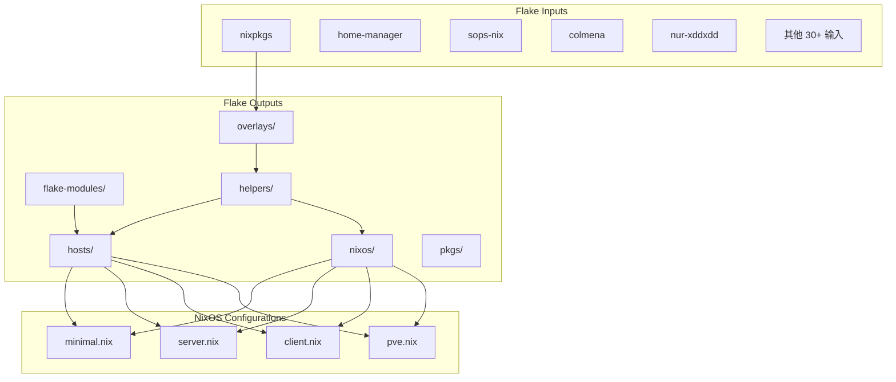
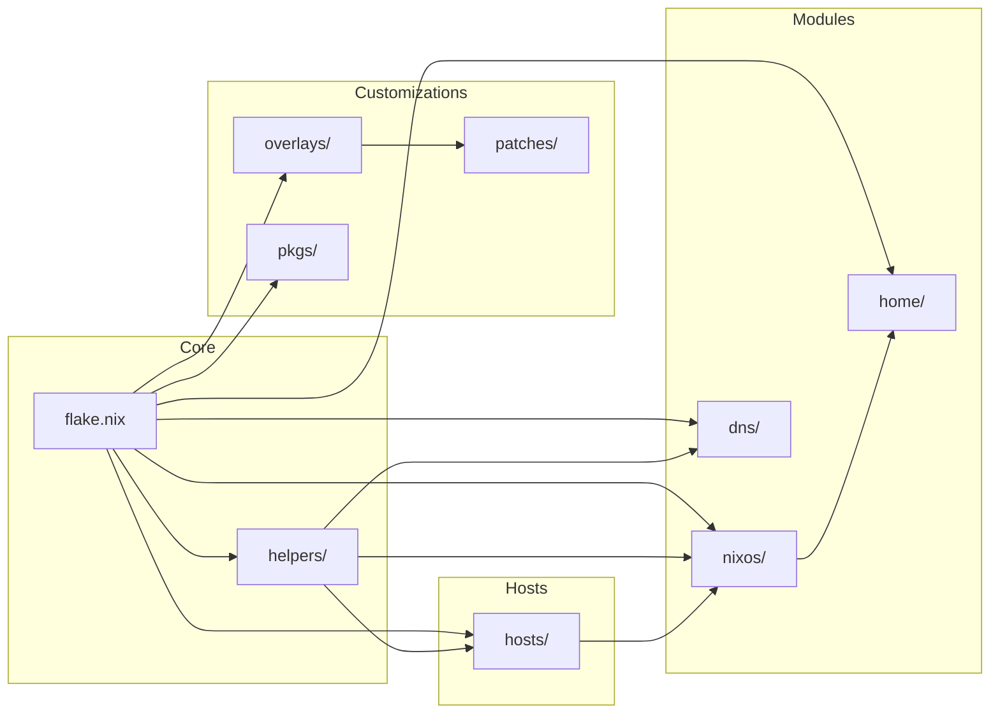

# Zhyi's NixOS Configuration

## 项目概述

这是一个基于 Nix Flakes 的 NixOS 配置项目，用于管理多台主机的系统配置。项目采用模块化设计，支持服务器、客户端和最小化三种配置类型，集成了大量自定义包、覆盖层和补丁。

### 核心特性

- **多主机管理**：支持 x86_64-linux 和 aarch64-linux 两种架构
- **模块化设计**：通过标签系统灵活组合功能模块
- **自定义包**：包含 Rust 编写的自定义工具
- **DNS 管理**：使用 DNSControl 管理 DNS 记录
- **部署工具**：支持 Colmena 批量部署

## 目录结构

```
.
├── .github/               # GitHub Actions 工作流
├── flake.nix              # Flake 入口文件
├── flake.lock             # Flake 锁文件
├── Makefile               # 构建命令
├── nvfetcher.toml         # 包版本管理配置
├── dns/                   # DNS 配置
├── flake-modules/         # Flake 模块
├── helpers/               # 辅助函数和常量
├── home/                  # Home Manager 配置
├── hosts/                 # 主机配置
├── nixos/                 # NixOS 模块
├── overlays/              # Nixpkgs 覆盖层
├── patches/               # 软件补丁
├── pkgs/                  # 自定义包
└── tools/                 # 辅助工具脚本
```

## 关键文件说明

### flake.nix

Flake 入口文件，定义了：

- **inputs**：所有外部依赖，包括 nixpkgs、home-manager、sops-nix、colmena 等 30+ 个输入
- **outputs**：使用 flake-parts 组织输出，导入 flake-modules 下的模块
- **系统支持**：x86_64-linux 和 aarch64-linux

### flake.lock

锁定所有输入的版本，确保可重现构建。

### Makefile

提供常用构建命令的快捷方式。

### nvfetcher.toml

用于管理一些非 Nixpkgs 包的版本更新。

## 主机配置说明

`hosts/` 目录包含所有主机的配置，每个主机是一个子目录，包含：

| 文件                         | 说明                                      |
| ---------------------------- | ----------------------------------------- |
| `host.nix`                   | 主机元数据（标签、IP、SSH 密钥等）        |
| `configuration.nix`          | 主配置文件                                |
| `hardware-configuration.nix` | 硬件配置（由 nixos-generate-config 生成） |

### 可用标签

| 标签             | 说明                                                       |
| ---------------- | ---------------------------------------------------------- |
| `client`         | 客户端配置（带 GUI）                                       |
| `cn-accel`       | 中国网络加速节点（启用 v2ray、openvpn-gameaccel）  |
| `dn42`           | DN42 节点                                                  |
| `nix-builder`    | Nix 远程构建节点                                           |
| `public-facing`  | 公网可访问节点（用于 Prometheus blackbox 监控等）          |
| `server`         | 服务器配置                                                 |
| `ipv4-only`      | 仅 IPv4                                                    |
| `ipv6-only`      | 仅 IPv6                                                    |
| `lan-access`     | 局域网访问                                                 |
| `cuda`           | NVIDIA CUDA 支持                                           |
| `low-ram`        | 低内存优化                                                 |

## 模块系统说明

`nixos/` 目录包含 NixOS 模块，采用分层设计：

### 配置类型

| 文件          | 说明            | 包含的模块                                                                        |
| ------------- | --------------- | --------------------------------------------------------------------------------- |
| `minimal.nix` | 最小化配置      | minimal-apps + minimal-components + minimal-modules + minimal-policies                                                 |
| `server.nix`  | 服务器配置      | minimal-apps + common-apps + server-apps + minimal-components + server-components + minimal-modules + minimal-policies |
| `client.nix`  | 客户端配置      | minimal-apps + common-apps + client-apps + minimal-components + client-components + minimal-modules + minimal-policies |
| `pve.nix`     | Proxmox VE 配置 | minimal-apps + minimal-components + pve-components + minimal-modules + minimal-policies                                       |

### 模块目录

| 目录                  | 说明                                                   |
| --------------------- | ------------------------------------------------------ |
| `minimal-apps/`       | 最小化应用（geoip、nginx-proxy、rsync-server）         |
| `common-apps/`        | 通用应用                                               |
| `server-apps/`        | 服务器应用（coredns、dn42-peerfinder、iperf、bird 等） |
| `client-apps/`        | 客户端应用（firefox、steam、thunderbird、fcitx 等）    |
| `minimal-components/` | 最小化组件（boot、networking、nix、ssh 等）            |
| `minimal-modules/`    | 可上游化模块（独立工作、默认禁用，仅添加 options）     |
| `minimal-policies/`   | 配置策略断言（assertions，检查配置正确性，自动导入到所有角色配置） |
| `server-components/`  | 服务器组件（backup、dn42、logging 等）                 |
| `client-components/`  | 客户端组件                                             |
| `pve-components/`     | Proxmox VE 组件（自动导入到 pve.nix）                  |
| `hardware/`           | 通用硬件配置片段（LVM、QEMU、NVIDIA 等，需在主机配置中手动导入） |
| `optional-apps/`      | 可选应用（部分主机使用，需在主机配置中手动导入）        |
| `optional-cron-jobs/` | 可选定时任务（部分主机使用，需在主机配置中手动导入）    |

### 策略断言说明

`nixos/minimal-policies/` 目录存放配置策略断言（assertions），用于在构建时检查配置是否符合预期约束。该目录会被 `minimal.nix`、`server.nix`、`client.nix`、`pve.nix` 等所有角色配置自动导入。

当前包含的策略：

| 文件                                  | 说明                                                          |
| ------------------------------------- | ------------------------------------------------------------- |
| `ensure-dynamicuser-correctness.nix`  | 确保自定义用户未启用 DynamicUser                              |
| `ensure-service-restart.nix`          | 确保所有 systemd 服务设置了 Restart 属性                      |
| `nginx-security.nix`                  | 确保 Nginx 虚拟主机的安全配置正确（localhost/public 访问控制） |
| `podman-ensure-autoupdate.nix`        | 确保所有 Podman 容器启用了自动更新                            |

## 自定义包说明

`pkgs/` 目录包含自定义 Nix 包。每个包目录包含：

- `default.nix` - Nix 构建定义
- `Cargo.toml` / `Cargo.lock` - Rust 依赖配置（适用于 Rust 包）
- `src/` - 源代码

## 覆盖层说明

`overlays/` 目录包含 Nixpkgs 覆盖层，按数字前缀排序执行。文件命名格式为 `数字前缀-描述.nix`，数字越小越先执行。

`overlays/default.nix` 会自动加载目录下所有非 `default.nix` 的 `.nix` 文件。

## 补丁说明

`patches/` 目录包含各种软件补丁：

- 根目录：通用软件补丁
- `patches/nixpkgs/`：针对 Nixpkgs 的补丁

## Flake 模块说明

`flake-modules/` 目录包含 Flake 输出模块：

| 文件/目录                  | 说明             |
| -------------------------- | ---------------- |
| `nixd.nix`                 | Nixd LSP 配置    |
| `nixos-configurations.nix` | NixOS 配置生成   |
| `nixpkgs-options.nix`      | Nixpkgs 选项配置 |
| `commands/`                | 自定义命令       |

## 其他重要组件

### helpers/ 目录

辅助函数和常量定义：

| 文件/目录          | 说明                                        |
| ------------------ | ------------------------------------------- |
| `default.nix`      | 主入口，导出所有辅助函数                    |
| `constants.nix`    | 常量定义                                    |
| `geo.nix`          | 地理位置数据                                |
| `host-options.nix` | 主机选项定义                                |
| `cities.json`      | 城市数据                                    |
| `constants/`       | 各类常量（端口、网络、区域等）              |
| `fn/`              | 辅助函数（nginx、hosts、service-harden 等） |

### dns/ 目录

DNS 配置，使用 DNSControl 管理：

| 目录/文件     | 说明         |
| ------------- | ------------ |
| `default.nix` | DNS 配置入口 |
| `core/`       | DNS 核心模块 |
| `domains/`    | 各域名配置   |

支持的 DNS 提供商：

- 注册商：DOH、Porkbun
- DNS 服务商：BIND、Cloudflare、deSEC、Gcore、HE.net

### home/ 目录

Home Manager 配置：

| 文件               | 说明                     |
| ------------------ | ------------------------ |
| `client.nix`       | 客户端 Home Manager 配置 |
| `none.nix`         | 空 Home Manager 配置     |
| `common-apps/`     | 通用应用配置             |
| `non-client-apps/` | 非客户端应用配置         |

## Agent 操作铁律（pi 会话执行层）

流程细则在 `docs/agent/`（development-handbook / work-norms / module-placement-norms /
deployment / hosts-overview / reference / inspection-playbook 等），不凭记忆猜。
以下是执行层硬规则：

1. **本机就是主控机（ml-laptop，NixOS）**：nix 求值、构建（`make build`）、部署
   （`make local` / `nix run .#colmena -- build/apply --on <host>`）、secrets 解密
   全部在本机执行；编译重活由 nix-distributed 自动派给 ml-builder / opi5p，
   不需要任何「交给别的机器准备」的流程。
2. **SSH 端口一律 2222**：`ssh -p 2222 root@<host>.zhyi.cc`；nix copy / ssh-ng
   分发派生必须带 `NIX_SSHOPTS="-i <key> -p 2222"` 与完整 URL
   `ssh://<user>@<host>:2222`，否则撞上各主机 LTNET 口的 endlessh 无限挂起。
3. **提交纪律**：改动完成后立即 conventional commit（中文说清「为什么」）并
   push origin；用户未提交的改动绝不丢弃；提交前核对暂存区只含本会话文件
   （pre-commit 会把暂存区里其他会话的改动一起卷进提交）。
4. **secrets**：secrets 仓在 `~/Documents/nixos/nixos-secrets`（main 分支）；
   sops 走 `nix run nixpkgs#sops`，明文永不提交；改完 push 后
   `https_proxy=socks5h://127.0.0.1:1080 nix flake update secrets`
   并提交主仓 `flake.lock`。
5. **代理**：GitHub 等外站走 `https_proxy=socks5h://127.0.0.1:1080`
   （curl/git/nix flake update 均适用）；家庭 LAN、LTNET（198.18.0.0/15）、
   dn42、yggdrasil、自有域（zhyi.cc/zhyi.xin/zhyi.dn42）一律直连。
6. **NixOS 纪律**：装软件只用 Nix，禁止 apt/brew；禁止 find / 等根目录搜索，
   禁止把 /nix/store 作为命令参数（细则见 `home/client-apps/ai-coding/rules/04-nixos.md`）。
7. **会话健康**：重复读已读文件 / 同一失败思路第 2 次重试 / 违反早期约束 /
   遗忘早期决定，≥2 条信号即提议交接；失败 2 次必须换方案，禁第 3 次原样重试；
   重探索子任务优先派 subagent。

主机 index/IP/ZeroTier 对照 `docs/agent/hosts-overview.md`；域名体系与双入口结构
对照 `docs/agent/domain-service-layout.md` 与 `docs/agent/fleet-service-chain.md`。

跟进上游（exam）用 `tools/exam-check log` / `tools/exam-check`，基线在
[`docs/agent/upstream-baseline.md`](docs/agent/upstream-baseline.md)；动共享路径前先跑
`tools/exam-check` 确认基线绿，流程见 work-norms §3「上游同步流程」。对齐质量
标准（人视角对齐：diff 零差异、禁止等价方案、注释写进文档不写代码）见
work-norms §3「对齐质量标准」，对齐类改动逐条对照。

## 架构图



## 依赖关系


