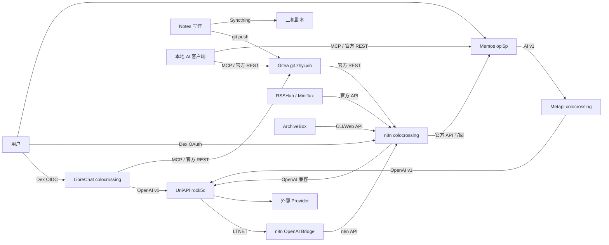

# AI 链 ↔ 知识链整合

> 状态：2026-08-12 规划确认后开始实施。本文记录 AI 链与知识链的关系模型、官方 API
> 接入点、集成候选、红线与验收方式；不保存任何 API key、口令或会话令牌。配置最终来源
> 仍是 `hosts/`、`nixos/` 与私有 `nixos-secrets`。

## 结论

- **AI 链是推理与编排面**：UniAPI 是唯一 Provider 汇聚点，LibreChat、Metapi、n8n
  都从 UniAPI 取模型；Memos 的 AI Provider 经 Metapi 再代理 UniAPI。
- **知识链是记忆与输入面**：`Notes -> Gitea` 是私有权威，Syncthing 负责三机分发；
  Blog/pyison 是公开索引；RSS、ArchiveBox、Memos 是持续输入源。
- **两条链通过官方 API 连接**：知识服务用 Gitea/Memos/Miniflux/Syncthing 官方 API
  暴露读写，AI 链用 UniAPI 的 OpenAI 兼容 `/v1` 提供推理，n8n 充当自动化中枢，
  LibreChat 与本地 AI 客户端通过 MCP/官方 REST 消费知识。
- **模型选择**：AI 链内统一使用 OpenCode Go 的 DeepSeek V4 Flash；UniAPI 中的实际
  模型别名以私有 `uni-api/` Provider 注册表为准，工具脚本默认 `deepseek-v4-flash`
  并允许通过 `AI_MODEL` 覆盖。

## 关系模型



## 服务与官方 API 清单

| 服务 | 主机 | 状态 | 官方 API / 协议 | 认证 | 文档 |
| --- | --- | --- | --- | --- | --- |
| UniAPI | `rock5c`、`jpvm` | 运行 / 声明（jpvm 未验证） | OpenAI 兼容 `/v1`（`/v1/models`、`/v1/chat/completions`） | Bearer `uni-api-admin-api-key` | `https://github.com/yym68686/uni-api` |
| LibreChat | `colocrossing` | 运行 | Web/客户端 REST `/api/*`；自定义 endpoint 指向 UniAPI | Dex OIDC + 会话/JWT | `https://www.librechat.ai/docs` |
| n8n | `colocrossing` | 运行 | REST `/api/v1`（workflows/executions/credentials）、webhooks | API key / Dex OAuth | `https://docs.n8n.io/api/` |
| n8n OpenAI Bridge | `colocrossing` | 运行 | OpenAI 兼容 `/v1/*`、`/health` | Bearer token | `https://github.com/xddxdd/n8n-openai-bridge` |
| Metapi | `colocrossing` | 运行 | OpenAI 兼容 `/v1` + 管理 API | UI 口令 + `PROXY_TOKEN` | `https://github.com/cita-777/metapi` |
| AxonHub | 未部署 | 未部署 | 未部署；模块保留 | 未部署 | `https://github.com/looplj/axonhub` |
| Qdrant | 未部署 | 未部署 | REST 6333 / gRPC 6334（`/collections`、`/points`、`/search`） | 可选 API Key | `https://api.qdrant.tech/api-reference/` |
| Gitea | `colocrossing` | 运行 | REST `/api/v1`（`/repos/{owner}/{repo}/...`）、Git/SSH 2222、webhook | API Token / OAuth2 / Basic | `https://docs.gitea.com/development/api-usage` |
| Syncthing | 三机 | 运行 | REST `/rest/*`（`/rest/events`、`/rest/db/status` 等） | `X-API-Key` | `https://docs.syncthing.net/dev/rest.html` |
| Miniflux | `colocrossing` | 运行 | REST `/v1`（`/v1/me`、`/v1/feeds`、`/v1/entries`） | `X-Auth-Token` | `https://miniflux.app/docs/api.html` |
| RSSHub | `colocrossing` | 运行 | HTTP 路由 + `?format=json` | private vhost | `https://docs.rsshub.app/` |
| ArchiveBox | `opi5p` | 运行 | CLI（`archivebox add/list/export`）、Web UI；JSON API 端点待核验 | Dex OAuth / 容器 CLI | `https://docs.archivebox.io/dev/` |
| Memos | `opi5p` | 运行 | REST `/api/v1/memos`、Connect `/memos.api.v1.*` | Personal Access Token | `https://github.com/usememos/memos`（`proto/gen/openapi.yaml`） |
| Dex | `cnvm` | 运行 | OIDC：`/auth`、`/token`、`/userinfo`、`.well-known/openid-configuration` | OIDC client secret | `https://dexidp.io/docs/` |

## 集成候选矩阵

| # | 候选 | 官方 API 组合 | 动作 / 价值 | 风险 | 优先级 |
| --- | --- | --- | --- | --- | --- |
| C1 | n8n 知识检索工作流 | Gitea REST + UniAPI `/v1` | 拉取 `zhyi/notes`，让 UniAPI 客户端问答私有笔记 | 工作流超时；PAT 权限需最小化 | P1 |
| C2 | LibreChat 知识源 | Gitea REST / 官方 MCP | 聊天界面内搜索/读取笔记 | 社区 MCP 无官方保证；需独立模块注入，不改公共 `mcp-servers.nix` | P1 |
| C3 | Syncthing 事件驱动 | Syncthing `/rest/events`、`/rest/db/status` | Notes 变更触发重索引或 AI 摘要 | 事件轮询延迟；API key 管理 | P1 |
| C4 | pyison 全文检索 | pyison HTTP 搜索（待核验） | 轻量检索 Blog/docs | API 未文档化；索引新鲜度依赖重建 | P2 |
| C5 | Memos 读写集成 | Memos `/api/v1/memos` + Connect API | 检索/创建/归档 memo，知识闭环 | PAT 范围；colocrossing→opi5p 走 LTNET | P2 |
| C6 | Qdrant 向量 RAG | Qdrant REST + UniAPI embeddings | Notes/Memos 语义检索 | 未部署；端口未登记；需先核验 embeddings | P2 |
| C7 | Gitea Actions 索引 | Gitea webhook / Actions | push 即触发重索引 | runner 资源；凭据写入 Notes 仓库需谨慎 | P2 |
| C8 | 本地 AI 客户端 | filesystem / Gitea MCP | 编码代理读写 Notes | AI 写权限；ml-2700 不可达期间无法验证 | P2 |
| C9 | Memos AI（现状） | OpenAI 兼容 `/v1` | 保持 Metapi → UniAPI，不做回环 | 默认不动 | P0 排除项 |
| C10 | Metapi / AxonHub 接知识链 | — | 不建议：管理网关只做模型路由 | 回环面扩大、凭据重复 | 排除 |

## 红线

- UniAPI 是唯一 Provider 汇聚点；禁止把 `metapi.*`、`axonhub.*`、`ai-api.zhyi.cc`
  反向配置为 UniAPI Provider；禁止 Metapi/AxonHub 互指或指向自身。
- 不修改公共模块：`flake-modules/`、公共 `nixos/` 模块（含 `nixos/optional-apps/*.nix`
  与 `nixos/client-apps/mcp-servers.nix`）不擅自修改；新能力用主机级编排或新建独立
  模块（`options.lantian.<name>` + `mkIf cfg.enable`）。
- 不直接改任何数据库：LibreChat MongoDB、n8n/AxonHub PostgreSQL、Gitea MySQL、
  Memos/Metapi SQLite 均为运行态；配置走官方 API/UI/CLI，新服务用独立数据文件。
- 凭据只进 SOPS secrets，不写进仓库正文、Notes 或文档。
- Notes 与 nixos-config 是两个独立 git 仓库，不混用、不放符号链接或 `.git` 指向。
- Waline 若恢复公开天线，其 LLM 审核必须指向 `uni-api.rock5c.zhyi.cc`，不得直连
  OpenRouter。
- Qdrant 未启用；若启用必须先规范为 options 门闩模块、核验 `hsnw_index` 疑点、
  登记端口 6333/6334，并确认 UniAPI 暴露 embedding 模型。

## 分阶段实施

### P0 文档基线（已确认）

- 本文件作为 AI 链 ↔ 知识链整合的权威入口。
- 同步更新 `ai-api-gateway-chain.md`、`fleet-service-chain.md`、知识链文档、
  `memos.md`、`rss-chain.md`、`inspection-playbook.md`。
- 明确 Qdrant/AxonHub/Waline 的“未部署/暂停”状态与 OpenRouter 红线。

### P1 最小闭环（优先）

1. `Gitea API 拉 Notes -> UniAPI 摘要 -> Memos 官方 API 写回/整理`；工具脚本见
   [`tools/knowledge-chain/notes-digest.sh`](../../tools/knowledge-chain/notes-digest.sh)。
2. n8n 定时工作流：Miniflux 未读摘要 + Memos 收件箱整理，全部走
   `uni-api.rock5c.zhyi.cc`。
3. LibreChat 只读知识源：独立模块注入 Gitea/Memos 官方 REST，不改公共 MCP 模块。
4. Syncthing REST 事件驱动重索引：先验证 API key 通道，再接入 n8n。

P1 运行态前置：`/run/secrets/gitea-ai-token`、`/run/secrets/memos-ai-token`、
`/run/secrets/miniflux-api-key`、`/run/secrets/syncthing-api-key` 是目标挂载路径。
它们当前尚未在私有 `nixos-secrets` 与主机级 SOPS 配置中创建；为避免修改公共模块，
运行前需在 secrets 仓库新增对应密钥，并通过 `hosts/<host>/` 层声明挂载，不写入
`nixos/` 公共模块。

### P2 条件项

- Qdrant 向量 RAG：先核验 UniAPI embeddings 与端口登记，以独立规范模块试点。
- pyison 检索复用、ArchiveBox 自动化、Gitea Actions 索引。
- 公开天线恢复时：Waline LLM 审核改指 UniAPI；pyison 内容源与索引重建机制实机核验。

## 验收命令

以下命令只验证，不打印密钥；在对应主机以 root/授权账号执行。

```bash
# Gitea 官方 API 读取 Notes 仓库（colocrossing 或可访问主机）
curl -fsS \
  -H "Authorization: token $(cat /run/secrets/gitea-ai-token)" \
  https://git.zhyi.xin/api/v1/repos/zhyi/notes

# UniAPI 模型列表（rock5c / colocrossing）
curl -fsS \
  -H "Authorization: Bearer $(cat /run/secrets/uni-api-admin-api-key)" \
  https://uni-api.rock5c.zhyi.cc/v1/models | jq '(.data // []) | length'

# n8n OpenAI Bridge 健康检查（colocrossing）
curl -fsS http://127.0.0.1:13333/health

# Memos 官方 API 读取（opi5p）
curl -fsS \
  -H "Authorization: Bearer $(cat /run/secrets/memos-ai-token)" \
  http://127.0.0.1:13819/api/v1/memos | jq '.memos | length'

# Miniflux 官方 API（colocrossing；需先验证 X-Auth-Token 是否可穿透 Dex OAuth vhost）
curl -fsS \
  -H "X-Auth-Token: $(cat /run/secrets/miniflux-api-key)" \
  https://rss.zhyi.xin/v1/me

# Syncthing 官方 REST（对应主机）
curl -fsS \
  -H "X-API-Key: $(cat /run/secrets/syncthing-api-key)" \
  http://127.0.0.1:13834/rest/db/status?folder=notes | jq '{state,needBytes,errors}'
```

## 未验证点

- 官方文档 URL 已在本文件核对；部分端点（ArchiveBox JSON API、pyison 搜索接口、
  Miniflux/Syncthing API key 穿透 OAuth vhost 的能力）需实施期实机验证。
- jpvm 与 ml-2700 当前不可达，公开 UniAPI 与本地 AI 客户端运行态未验证。
- UniAPI 的 `deepseek-v4-flash` 模型别名是否存在于当前 Provider 注册表，需以
  `/v1/models` 实机核验。
