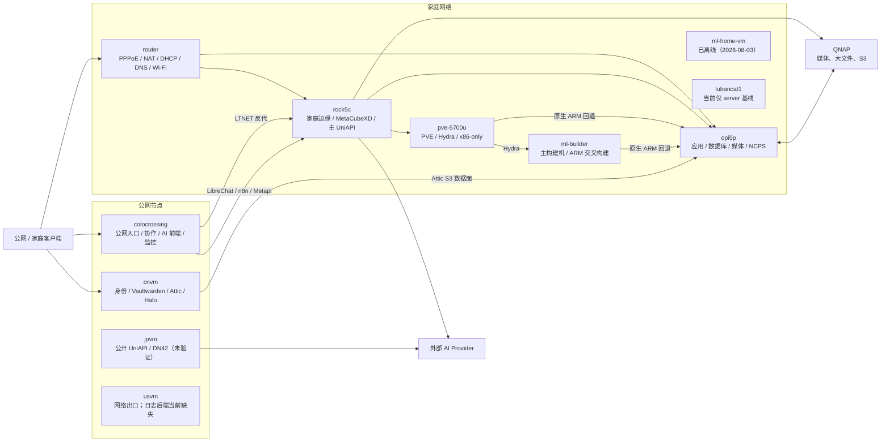

# 全主机服务归属与链路

最后实机审计：2026-08-03
文档与 Homepage 复核：2026-08-11

本文是当前自有主机、主要服务和跨主机调用关系的运行态账本。主机与模块的最终声明
仍以 `hosts/`、`nixos/` 和私有 secrets 仓库为准；本文额外记录审计时实际运行的
systemd 单元、Podman 容器、定时任务、远程 builder 表和 Nix substituter。

本文不枚举 `dbus`、`journald`、`getty` 等操作系统基础单元。状态含义如下：

- **运行**：已通过 SSH 在目标机看到对应 active systemd unit 或 running 容器；
- **声明**：仓库已导入模块，但目标机不可达、尚未部署或 unit 被 activation marker
  阻止启动；
- **漂移**：文档、仓库声明和实机运行代际不一致。

## 总体拓扑



## 主机账本

审计时共声明 14 台主机。10 台可连接，其中 8 台为 `running`；`colocrossing` 与
`usvm` 因 `openvpn-gameaccel.service` 失败处于 `degraded`。另外 4 台只能核对声明。

| 主机 | 角色 | 主要服务归属 | 审计状态 |
| --- | --- | --- | --- |
| `router` | 家庭路由器 | PPPoE、NAT/防火墙、Kea DHCP、CoreDNS、DDNS、hostapd、mDNS、MiniUPnP、NMEA、V2Ray、NCPS client | 运行，0 failed units |
| `ml-2700` | `client` | 桌面客户端；无专用服务器应用 | LAN 与 LTNET 均不可达，只确认声明 |
| `ml-builder` | 主 `nix-builder`、server | 受限并发 x86 构建（4 任务 × 8 核）、ARM 交叉构建、分布式 Nix、NCPS client；server 网络/DNS/监控基线 | 运行；builder 表有回边漂移 |
| `ml-home-vm` | server | BIRD、WG/WSS、CoreDNS authoritative、Knot、PowerDNS Recursor、Nginx、Filebeat、exporters | 已退役（2026-08-03）：服务迁至 ROCK5C/OPI5P/PVE，备份端点已迁移 OPI5P |
| `pve-5700u` | PVE、Hydra、回退 builder | Proxmox VE、Hydra、PostgreSQL、ArchiveTeam、ClawEmail、Epic Awesome Gamer、NCPS client、VM 数据备份 | 运行；`backup-nvme-nixos-home-vm` 因备份端点迁移而失败（配置已修，待部署） |
| `jpvm` | 公网、DN42、`cn-accel` | server 公共基线、公开 UniAPI、V2Ray/OpenVPN 加速 | 公网和 LTNET 均不可达，运行态未验证 |
| `cnvm` | 公网 server | Attic、Dex、Pocket ID、Vaultwarden、GLAuth、Halo、OAuth2 Proxy、MySQL、PostgreSQL、DNS/Nginx | 运行，0 failed units |
| `colocrossing` | 公网、DN42、协作与监控中心 | 公网入口、ACME、Gitea、Matrix、邮件、RSS、NetBox、LibreChat、n8n、Metapi、Prometheus、Grafana、ClickHouse、ZeroTier Controller 等 | 运行；OpenVPN 失败，系统 degraded |
| `usvm` | 公网、`cn-accel` | server 公共基线、V2Ray、Filebeat；声明中的日志汇聚后端当前不存在 | 运行；OpenVPN 失败，系统 degraded |
| `opi5p` | server、原生 ARM 回退 builder | 数据库、家庭应用、下载自动化、NCPS、文件服务、打印、ClamAV、reDroid | 运行，0 failed units |
| `rock5c` | server、家庭边缘 | 家庭 Nginx 入口、MetaCubeXD、Homepage、主 UniAPI、FastAPI-DLS、GLAuth、vlmcsd、媒体应用（MoviePilot/Jellyfin/HandBrake）、reDroid | 运行，0 failed units |
| `lubancat1` | `low-ram` server | BIRD、WG/WSS、Yggdrasil、ZeroTier、CoreDNS、Nginx、exporters、Bluetooth | 运行，0 failed units；尚未迁入用户应用 |
| `h28k` | 预部署异地 Router | DHCP、CoreDNS、NAT/防火墙、zram | 不可达；SSH/SOPS/ZeroTier 身份未完成 |
| `opi03` | 实验性 ARM 板卡 | H618 reDroid；以 `.image-ready` marker 阻止缺镜像时启动 | 无正式地址，未验证；相关配置仍在开发中 |

## 按链路归属

### 网络、域名与入口

| 功能 | 运行主机 | 说明 |
| --- | --- | --- |
| 家庭 WAN/LAN | `router` | PPPoE、DHCP、NAT、Wi-Fi、DDNS 与家庭 Hairpin 入口 |
| 公网应用入口 | `colocrossing` | 大部分 `zhyi.xin` 应用、OAuth 入口与到家庭 ROCK 5C 的 LTNET 反代 |
| 身份与 Attic 入口 | `cnvm` | Dex、Pocket ID、Vaultwarden 与 Attic 直接在本机终止 HTTPS |
| 家庭 Web 边缘 | `rock5c` | 原 `*.ml-home-vm.zhyi.cc` 服务别名及家庭应用入口；向 OPI5P、PVE、QNAP 反代 |
| 家庭数据直达 | `opi5p` | 8443 家庭入站、VaultS3、媒体与文件服务，不经 ROCK 5C 中转大流量 |
| 证书 | `colocrossing` | ACME timers 集中续签各主机和域名证书 |
| Overlay/路由 | 各 server；控制器在 `colocrossing` | BIRD、WireGuard/WSS、Yggdrasil、ZeroTier；DN42/RPKI/Bird-LG 主要在 colocrossing |

家庭 server 的公共基线并不表示它们都承担公网应用。`ml-home-vm`、`ml-builder` 和
`lubancat1` 当前主要使用该基线取得 LTNET、DNS、监控、备份与远程管理能力。

### 身份链

```text
用户 -> 应用 Nginx/OAuth2 Proxy -> cnvm Dex/Pocket ID/GLAuth
                                  -> 应用自身会话/数据库
```

| 服务 | 主机 | 状态 |
| --- | --- | --- |
| Dex | `cnvm` | 运行 |
| Pocket ID | `cnvm` | 运行 |
| Vaultwarden | `cnvm` | 运行 |
| GLAuth | `cnvm`、`rock5c` | 两个实例均运行；迁移时不能当作同一个进程 |
| OAuth2 Proxy | `cnvm`、`rock5c`、`opi5p` | 随各自主机受保护 vhost 运行 |

### AI 链

```text
LibreChat / Metapi / n8n（colocrossing）
                    |
                    v
         主 UniAPI（rock5c） -> 外部 Provider
                    |
                    `-> n8n OpenAI Bridge（colocrossing）

ai-api.zhyi.cc -> 独立 UniAPI（jpvm，当前未验证） -> 外部 Provider
```

- `LibreChat`、`n8n`、`n8n-openai-bridge` 和 `Metapi` 已确认在 `colocrossing` 运行；
- 主 `uni-api.service` 已确认在 `rock5c` 运行；`ml-home-vm` 没有该 unit；
- LibreChat 与 Metapi 已改为直接使用 `uni-api.rock5c.zhyi.cc`，由 colocrossing
  通过 LTNET 访问 ROCK 5C 上的主 UniAPI；
- `AxonHub` 模块存在，但没有被任何 host 导入，实机也没有 `axonhub.service`；它是
  未部署候选，不是当前链路的一部分；
- `jpvm` 声明独立公开 UniAPI，但主机不可达，不能标记为已运行。

UniAPI 仍是唯一外部 Provider 汇聚点。不得把 Metapi、AxonHub 或 n8n Bridge 反向
配置为循环上游。

### 构建与缓存链

目标链路：

```text
Hydra（pve-5700u） -> ml-builder（x86、大包、ARM 交叉）
                   `-> opi5p（仅原生 ARM、单任务）

Nix clients -> Attic（cnvm） -> VaultS3（OPI5P -> QNAP）
            `-> NCPS（opi5p:13851） -> 公共上游缓存
```

实机 substituter：

- `ml-builder`、`router`、`opi5p`、`pve-5700u`：先 Attic，再 OPI5P NCPS；
- `rock5c`、`lubancat1`：先 Attic，再直接使用公共镜像与 cache.nixos.org；`ml-home-vm` 已退役，不再参与；
- ml-builder 的 `builders-use-substitutes = false`，由主构建机集中下载后传给远端。

审计发现当前 ml-builder 的 `/etc/nix/machines` 仍同时列出 OPI5P 和 PVE；PVE 又列出
ml-builder 与 OPI5P。这违反有向无环约束，说明排除 PVE 的新代际尚未在 ml-builder
生效。在修复前存在再次出现双向输出锁等待的风险。

### 家庭应用、数据与媒体链

`opi5p` 仍是重状态家庭应用节点，`rock5c` 承接媒体播放层：

- 数据库与缓存（opi5p）：PostgreSQL、MySQL、Redis for Immich、Redis for SearXNG；
- 家庭应用（opi5p）：Immich、Memos、Home Assistant、ArchiveBox、FileCodeBox、
  SunPanel、SearXNG、Calibre COPS；RSS 阅读链为 colocrossing 的 Miniflux/RSSHub，
  ArchiveBox 承担无法订阅站点的归档；
- 下载链路（router）：qBittorrent 单实例；
- 下载消费方（opi5p）：Bitmagnet、PeerBanHelper、Tachidesk；
- 媒体应用（rock5c）：MoviePilot、Jellyfin、HandBrake；
- 文件与设备（opi5p）：NCPS、Syncthing、SFTP、WebDAV、Samba、NFS/QNAP mount、
  VaultS3 代理、CUPS、Avahi、ClamAV。

媒体文件仍在 NAS 上由 router、opi5p、rock5c 三机直接 NFS 挂载；MoviePilot
写 `.nfo` 元数据，Jellyfin 保持只读。NAR、S3
与 NAS 大流量仍不经 ROCK 5C 中转。

PVE 保留不提供 ARM64 镜像的 ArchiveTeam、ClawEmail 和 Epic Awesome Gamer。
ml-home-vm 已退役，旧 `*.ml-home-vm.zhyi.cc` 名称不应再被当作实际后端。

### 协作、监控与日志链

`colocrossing` 承担：

- 协作/内容：Gitea、Gitea Actions、Matrix Synapse workers、Mautrix GMessages、
  Lemmy、Maddy、NetBox、Bepasty、Radicale、Miniflux、RSSHub、Quassel、Syncthing；
- AI 前端/自动化：LibreChat、n8n、n8n task runner、n8n OpenAI Bridge、Metapi；
- 监控：Prometheus、Alertmanager、Grafana、Blackbox exporter、ClickHouse、
  Plausible、FlapAlerted、Bird-LG、StayRTR 和各类 exporter；
- 计划任务：集中 ACME、imapfilter、Radicale sync、GitHub 通知清理、DN42
  certificate 和 TestSSL。

`tg-bot-cleaner` 模块已导入，但审计时没有 active unit；配置中的 `ExecCondition` 会
在凭据不完整时阻止启动，应标记为“已声明、未运行”。

日志链当前不完整：非 `low-ram` server 的 Filebeat 配置为发送到
`es-ingest.usvm.zhyi.cc`，但 `usvm` 没有导入 Elasticsearch 模块，实机也没有
Elasticsearch unit 或容器。因此不能把日志汇聚写成“正常运行”。

## 服务清单与 Homepage 核对（2026-08-11 复核）

账号与口令线索不写入本仓库，完整速查在私有 `nixos-secrets` 仓库的
`docs/service-login-audit.md`。Homepage 卡片已在
`homepage-dashboard-config.nix` 中核对，见
[`homepage-link-audit.md`](../services/homepage-link-audit.md)。

### Homepage 卡片

| 服务 | 入口 | 认证方式 |
| --- | --- | --- |
| Dex | `https://login.zhyi.xin` | OIDC/LDAP |
| Pocket ID | `https://id.zhyi.xin` | Passkey / LDAP / 邮箱 OTP |
| Vaultwarden | `https://bitwarden.zhyi.xin` | 应用登录 |
| LibreChat | `https://ai.zhyi.xin` | Dex OIDC |
| n8n | `https://n8n.zhyi.xin` | Dex OAuth |
| Halo | `https://zhyi.xin` | Dex OAuth / 应用管理员 |
| Posts | `https://posts.zhyi.xin` | 公开只读 |
| Lemmy API | `https://lemmy.zhyi.xin` | 公开 API |
| Miniflux | `https://rss.zhyi.xin` | Dex OAuth |
| Radicale | `https://cal.zhyi.xin` | LDAP |
| Element | `https://element.zhyi.xin` | Matrix / LDAP |
| Element Matrix API | `https://matrix-client.zhyi.xin` | Matrix API |
| Plausible | `https://stats.zhyi.xin` | 应用管理员 |
| Bepasty | `https://pb.zhyi.xin` | 分享链接 / 无账号 |
| IT Tools | `https://tools.zhyi.xin` | 公开 |
| Sun Panel | `https://index.zhyi.xin` | Dex OAuth |
| Sun Panel Helper | `https://index-helper.zhyi.xin` | Dex OAuth |
| FileCodeBox | `https://filebox.zhyi.xin` | 应用管理 |
| 网络信息 API | `https://api.zhyi.xin/geoip` | 公开 |
| Avatar API | `https://avatar.zhyi.xin` | 公开 |
| ArchiSteamFarm | `https://asf.zhyi.xin` | Dex OAuth / IPC |
| Calibre COPS | `https://books.zhyi.xin` | Basic Auth |
| Immich | `https://immich.zhyi.xin` | 应用登录 |
| Tachidesk | `https://tachidesk.zhyi.xin` | Basic Auth |
| Jellyfin | `https://jellyfin.zhyi.xin` | 应用登录 |
| Hydra | `https://hydra.zhyi.cc` | 应用登录 |
| Attic | `https://attic.zhyi.xin` | 上传 token |
| Gitea | `https://git.zhyi.xin` | 应用登录 / SSH |
| NetBox | `https://netbox.zhyi.cc` | Dex OAuth |
| Grafana | `https://dashboard.zhyi.cc` | Dex OAuth |
| Prometheus | `https://prometheus.zhyi.cc` | Dex OAuth |
| Alertmanager | `https://alert.zhyi.cc` | Dex OAuth |
| Bird Looking Glass | `https://lg.zhyi.cc` | 公开只读 |
| FlapAlerted | `https://flapalerted.zhyi.cc` | 公开只读 |
| Uni API | `https://uni-api.rock5c.zhyi.cc` | API key |
| MetaAPI | `https://metapi.colocrossing.zhyi.cc` | 应用口令 / token |
| n8n OpenAI Bridge | `https://n8n-bridge.colocrossing.zhyi.cc/health` | bearer token |
| SearxNG | `https://searx.opi5p.zhyi.cc` | 私有 |
| FastAPI DLS | `https://fastapi-dls.rock5c.zhyi.cc` | 租约 token |
| RSSHub | `https://rsshub.zhyi.xin` | 私有 |
| PVE | `https://pve-5700u.zhyi.cc:8006` | 应用登录 |
| CouchDB | `https://couchdb.zhyi.cc/_utils/` | 应用管理 |
| Attic NCPS fallback | `https://attic.zhyi.xin` | 无登录 |
| VaultS3 | `https://vaults3.zhyi.cc:8443/dashboard/` | S3 凭据 |
| MetaCubeXD | `https://metacubexd.rock5c.zhyi.cc` | 控制 token |
| 代理订阅 | `https://sub.zhyi.cc` | 应用登录 / 订阅 token |
| OpenSpeedTest | `https://openspeedtest.rock5c.zhyi.cc` | 私有 |
| qBittorrent | `https://bt.router.zhyi.cc` | WebUI 登录 |
| PeerBanHelper | `https://peerbanhelper.opi5p.zhyi.cc` | API token |
| BitMagnet | `https://bitmagnet.opi5p.zhyi.cc/webui/` | 私有 |
| MoviePilot | `https://moviepilot.rock5c.zhyi.cc` | 应用登录 |
| Home Assistant | `https://ha.zhyi.cc` | Dex OAuth |
| Syncthing | `https://syncthing.opi5p.zhyi.cc` | Dex OAuth |
| Syncthing (Colocrossing) | `https://syncthing.colocrossing.zhyi.cc` | Dex OAuth |
| ArchiveBox | `https://archivebox.opi5p.zhyi.cc` | Dex OAuth |
| WebDAV（webdev） | `https://dav.opi5p.zhyi.cc` | Basic Auth |
| QNAP NAS | `https://qnap.zhyi.cc` | 应用管理 |
| Memos | `https://memos.opi5p.zhyi.cc` | Dex OIDC / 应用登录 |
| 主机资源 / NAS 存储 | 见 Homepage `12 · 私有 · 监控` | Prometheus 只读 |

### 协议与无 Web UI 服务

| 服务 | 入口 | 认证方式 |
| --- | --- | --- |
| SMTP（出站） | `send.ahasend.com`（美加墨为 `send-us.ahasend.com`），587 STARTTLS | SMTP AUTH |
| Maddy（邮件收发） | `mail.zhyi.xin`，25/465/587 | 本地邮箱 |
| IMAP | `imapfilter` 定时任务（Outlook/Gmail/Lantian） | secrets 内配置 |
| SFTP | `sftp.opi5p.ltnet.zhyi.cc`（等价 `opi5p.zhyi.cc`），端口 2222 | SSH 公钥 |
| Samba | `//opi5p/storage` | 账号登录 |
| NFS | `192.168.0.40:/nixos` | IP 白名单 |
| CalDAV/CardDAV | `https://cal.zhyi.xin` | LDAP |
| Matrix 联邦 | `https://matrix.zhyi.xin` | LDAP |
| Git SSH | `git.zhyi.xin:2222` | SSH 公钥 |
| rsync CI | 由 `ssh/rsync-ci.nix` 公钥限制 | SSH 公钥 |
| VaultS3 S3 API | `vaults3.zhyi.cc:8443` | S3 凭据 |
| Attic 上传 API | `https://attic.zhyi.xin` | token |
| NCPS | `opi5p:13851` | 无登录 |
| restic/rustic 备份 | `ssh://opi5p.zhyi.cc:2222` | SSH 公钥 + 仓库口令 |

Homepage 按“没有 Web UI 的协议不添加虚假卡片”规则不为 SMTP、SFTP、Samba、
NFS 等生成卡片；WebDAV 卡片保留在 `08 · 私有 · 家庭服务` 分组。

## 当前漂移与处理优先级

| 优先级 | 漂移 | 风险 | 后续处理 |
| --- | --- | --- | --- |
| P0 | ml-builder 运行态仍把 PVE 列为下游 builder | PVE 与 ml-builder 可再次互相等待同一 store lock | 部署 ml-builder 后复核 `/etc/nix/machines` |
| P0 | Filebeat 指向不存在的 usvm Elasticsearch | 舰队日志持续无法落库 | 对照作者决定恢复 Elasticsearch 或关闭/改写日志链 |
| P1 | LibreChat/Metapi 曾使用未解析的 `uni-api.ml-home-vm.zhyi.cc` | AI 调用依赖旧别名 | 已统一改为 `uni-api.rock5c.zhyi.cc` 并完成模型检查 |
| P1 | AxonHub 只在文档出现，未部署 | 运维人员会误判已有网关和数据库 | 保持“未部署候选”，除非明确重新导入模块 |
| P1 | colocrossing、usvm 的 OpenVPN gameaccel 同时失败 | 两台系统 degraded，CN 加速链不完整 | 检查证书、密钥和服务日志后修复或明确禁用 |
| P2 | hosts 概览仍把 LubanCat-1 写成 DHCP/minimal，遗漏 OPI03 | 接入与容量判断错误 | 已随本次文档更新 |
| P2 | ROCK 5C/OPI5P 部分迁移注释仍称入口在 ml-home-vm | 后续维护可能把代理改回旧 VM | 当前链路文档已改为 ROCK 5C；历史迁移注释保留为记录 |

在 P0 链路修复前，不继续扩大 LubanCat-1 的服务迁移范围。LubanCat-1 的候选服务和
资源预算见[服务链路与 LubanCat-1 迁移审计](service-chain-lubancat-audit.md)。

## 维护规则

1. 服务迁移必须同时更新 host import、入口反代、DNS、OAuth 回调、监控 target、
   Homepage 卡片和本账本；
2. 旧域名可以作为兼容别名保留，但文档必须分别写明“服务名”和“实际运行主机”；
3. activation marker 存在时，模块导入只代表已部署定义，不代表 writer 正在运行；
4. 不可达主机不得标为运行，容器镜像存在也不等于容器已启动；
5. 实机审计至少检查 `systemctl --failed`、running services、Podman containers、
   timers、`/etc/nix/machines` 和 `nix config show substituters`；
6. 文档不保存 API key、口令、private key、会话 token 或 Provider 凭据。
