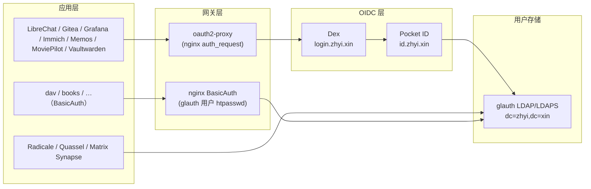

# 身份认证架构

> 最后核对：2026-08-15（对照作者原版 `nixos-config-exam`）。
> 本文描述身份链的静态架构；新增 OIDC 应用的**操作步骤**见
> [OIDC 应用接入规范](./oidc-app-integration.md)，运行态账本见
> [全主机服务归属与链路](./fleet-service-chain.md)。

## 一句话总结

**单一用户存储（glauth LDAP）+ 多前端认证（Pocket ID Passkey / LDAP 密码 /
nginx BasicAuth）+ Dex OIDC 出口 + oauth2-proxy 应用网关**。所有登录最终都落到
同一个 glauth 用户库；没有第二套目录服务。

```
应用 Nginx ──> oauth2-proxy ──> Dex (login.zhyi.xin)
                                  └─> connector: Pocket ID (id.zhyi.xin)
                                                   └─> 用户后端: glauth LDAP
Radicale / Quassel / Matrix Synapse ──> glauth LDAP（直连）
简单服务（dav/books/…）──> nginx BasicAuth（htpasswd 来自同一 glauth 用户）
```

## 架构图



## 组件明细

| 组件 | 角色 | 入口/协议 | 承载主机 | 数据源 |
| --- | --- | --- | --- | --- |
| **glauth** | 用户目录（LDAP/LDAPS） | `:389` / `:636`，baseDN `dc=zhyi,dc=xin` | `volcengine`、`rock5c`（独立实例） | secrets `glauth-users.nix`（bcrypt） |
| **Pocket ID** | Passkey（无密码）身份提供方 | `https://id.zhyi.xin` | `volcengine` | PostgreSQL；用户后端 = glauth LDAP（`LDAP_ENABLED=true`） |
| **Dex** | OIDC 出口/聚合（应用统一入口） | `https://login.zhyi.xin` | `volcengine` | PostgreSQL；connector = Pocket ID |
| **oauth2-proxy** | Nginx 层 OAuth 强制 | 本机 unix socket | `volcengine`/`rock5c`/`opi5p`（随 vhost） | secrets `oauth2-proxy` cookie |
| **Vaultwarden** | 密码库（旁路） | `https://bitwarden.zhyi.xin` | `volcengine` | 自有数据库 |
| **nginx BasicAuth** | 简单服务共享凭据（旁路） | vhost `enableBasicAuth` | 各承载主机 | htpasswd 由 `glauth-users.nix` 的 `zhyi` 生成 |

## 认证流程

### 1. 交互式应用（OIDC，推荐）

```
浏览器 → 应用（如 https://ai.zhyi.xin）
  → oauth2-proxy 检测未登录 → 302 到 Dex（login.zhyi.xin）
  → Dex connector 转发到 Pocket ID（id.zhyi.xin）
  → Pocket ID Passkey 验证（或回退 LDAP 密码）
  → 回调 Dex → 签发 OIDC token → oauth2-proxy 通过 auth_request
  → 应用拿到 X-User / X-Email / X-Groups 头
```

### 2. 协议型应用（直连 LDAP）

Radicale（`cal.zhyi.xin`）、Quassel、Matrix Synapse 直接向 glauth 做
LDAP bind（`cn=serviceuser,dc=zhyi,dc=xin`），凭据即用户目录里的密码。

### 3. 简单服务（BasicAuth）

`enableBasicAuth` 的 vhost（dav、books 等）用 glauth 用户 `zhyi` 的 htpasswd
校验；凭据与 LDAP 密码一致，不新增账号体系。

## OIDC 客户端（Dex staticClients）

| client id | 应用 | 说明 |
| --- | --- | --- |
| `gitea` | Gitea | git.zhyi.xin |
| `grafana` | Grafana | dashboard.zhyi.xin |
| `immich` | Immich | immich.zhyi.xin |
| `librechat` | LibreChat | ai.zhyi.xin |
| `memos` | Memos | memos.opi5p.zhyi.cc |
| `moviepilot` | MoviePilot | moviepilot.rock5c.zhyi.cc |
| `oauth-proxy` | oauth2-proxy | 所有 `enableOAuth` vhost 共用 |
| `vaultwarden` | Vaultwarden | bitwarden.zhyi.xin |

## 凭据与 secrets

| 资产 | 位置 | 说明 |
| --- | --- | --- |
| 用户目录（明文） | secrets `glauth-users.nix` | `zhyi`（uid 1000）、`serviceuser`（bind）、各服务账号；只含 bcrypt/mail 等非敏感字段 |
| glauth 服务凭据（加密） | secrets `common/glauth.yaml` | glauth 进程使用的敏感字段 |
| Dex 客户端密钥 | secrets `common/dex.yaml` | 每个 staticClient 一个 `dex-<id>-secret` |
| Pocket ID | secrets `pocket-id.yaml` | 加密密钥 + Dex 对接凭据 |
| oauth2-proxy | secrets `common/oauth2-proxy.yaml` | cookie 密钥等 |
| Vaultwarden | `dex-vaultwarden-secret`（common/dex.yaml）+ 自有数据库 | SSO 走 Dex，数据自管 |

## 与作者原版的对应（复刻对照）

| 项 | 作者（xddxdd） | 本仓库 | 差异说明 |
| --- | --- | --- | --- |
| LDAP baseDN | `dc=lantian,dc=pub` | `dc=zhyi,dc=xin` | 域名替换 |
| 主用户 | `lantian` | `zhyi` | 域名替换 |
| Dex connector | Pocket ID（`id="ldap"` 向后兼容） | 同左 | 原样保留 |
| 部署分布 | colocrossing 全套 + lt-home-vm/virmach 各一份 glauth | volcengine 全套 + rock5c 一份 glauth | 布局一致（主节点 + 家庭/边缘节点） |
| 入口 | login.lantian.pub / id.lantian.pub / bitwarden | login.zhyi.xin / id.zhyi.xin / bitwarden.zhyi.xin | 域名替换 |

> 作者的 Dex connector `id = "ldap"`（注释 "Backwards compatibility"）是历史演化
> 痕迹：Dex 从"直连 LDAP"迁移到"经 Pocket ID"，但 connector id 保持不变，避免
> 已接入应用刷新缓存后失配。我们复刻时原样保留。

## 服务接入审计（2026-08-15 全量）

口径：以当前部署的服务为准（对照 `fleet-service-chain.md` 服务表与各主机模块导入），
逐个核对 vhost 的 `enableOAuth` / `enableBasicAuth` / `accessibleBy`、Dex
staticClients 与 LDAP 消费者。模块存在但**没有被任何主机导入**的，不纳入账本。

### 在体系内

**A. oauth2-proxy 网关接入（nginx `auth_request` → Dex，浏览器统一跳 `login.zhyi.xin`）**

| 服务 | 入口 | 承载主机 |
| --- | --- | --- |
| Prometheus | `prometheus.zhyi.xin` | tencent |
| Alertmanager | `alert.zhyi.xin` | tencent |
| NetBox | `netbox.zhyi.xin` | greencloud |
| Miniflux | `rss.zhyi.xin` | greencloud |
| n8n | `n8n.zhyi.xin` | greencloud |
| ArchiSteamFarm | `asf.zhyi.xin` | rock5c 边缘 → opi5p |
| 代理订阅（登录部分） | `sub.zhyi.xin` | greencloud |
| Syncthing | `syncthing.opi5p.zhyi.cc` / `syncthing.greencloud.zhyi.cc` | opi5p / greencloud |
| ArchiveBox | `archivebox.opi5p.zhyi.cc` | opi5p |
| Ignis | `ignis.opi5p.zhyi.cc` | opi5p |
| Halo 管理后台 | `halo.volcengine.zhyi.cc` | volcengine |

**B. 应用内 OIDC（应用自己实现 OIDC，client 注册在 Dex）**

| 服务 | 入口 | Dex client |
| --- | --- | --- |
| LibreChat | `ai.zhyi.xin` | `librechat` |
| Gitea（登录页强制跳 Dex） | `git.zhyi.xin` | `gitea` |
| Grafana | `dashboard.zhyi.xin` | `grafana` |
| Memos | `memos.opi5p.zhyi.cc` | `memos` |
| MoviePilot | `moviepilot.rock5c.zhyi.cc` | `moviepilot` |
| Vaultwarden（SSO 可跳 Dex，主密码仍自身） | `bitwarden.zhyi.xin` | `vaultwarden` |

**C. LDAP 直连（glauth `dc=zhyi,dc=xin`）**

| 服务 | 入口 | 说明 |
| --- | --- | --- |
| Radicale（CalDAV/CardDAV） | `cal.zhyi.xin` | LDAP bind 认证 |
| Quassel（IRC） | greencloud | `AUTH_LDAP` |
| Matrix Synapse | `matrix-client.zhyi.xin` | `ldap_auth_provider`（Element 账号即目录账号） |
| Pocket ID | `id.zhyi.xin` | 用户后端（体系组件自身） |

**D. BasicAuth（htpasswd 由 glauth 的 `zhyi` 用户生成）**

| 服务 | 入口 | 承载主机 |
| --- | --- | --- |
| WebDAV | `dav.zhyi.xin` | rock5c 边缘 → opi5p |
| Calibre COPS | `books.zhyi.xin` | rock5c 边缘 → opi5p |
| Tachidesk | `tachidesk.zhyi.xin` | rock5c 边缘 → opi5p |

**J. 自带认证 + 统一凭据（应用自有登录，账号统一 `zhyi` / `default-pw`，不挂
oauth2-proxy）**

| 服务 | 入口 | 承载主机 | 说明 |
| --- | --- | --- | --- |
| Home Assistant | `ha.opi5p.zhyi.cc` | opi5p | 内网私有，HA 自有账号 |
| Sun Panel | `index.zhyi.xin` | opi5p | Sun Panel 自有账号 |
| Sun Panel Helper | `index-helper.zhyi.xin` | opi5p | 资源后端随面板 |
| Resilio Sync | `resilio.opi5p.zhyi.cc/gui/` | opi5p | webui 凭据由模块强制为 zhyi/default-pw |

### 体系外

**E. 自带账号体系（未接身份链）**

| 服务 | 入口 | 认证 |
| --- | --- | --- |
| Immich | `immich.zhyi.xin` | 应用登录（Dex 有 `immich` client 但**未接线**，见审计结论） |
| Jellyfin | `jellyfin.zhyi.xin` | 应用登录 |
| qBittorrent | `bt.router.zhyi.cc` | WebUI 登录 |
| PVE | `pve-5700u.zhyi.cc:8006` | 应用登录 |
| Plausible | `stats.zhyi.xin` | 应用管理员 |
| FileCodeBox | `filebox.zhyi.xin` | 应用管理 |
| Bepasty | `pb.zhyi.xin` | 分享链接 / 无账号 |
| QNAP NAS | `qnap.zhyi.xin` | 应用管理 |
| Hydra | `hydra.zhyi.xin` | 应用登录 |
| Element / Matrix | `element.zhyi.xin` | Matrix 账号（目录在 LDAP，但认证是 Matrix 自身） |
| Sonarr / IYUU / llama-cpp / step-ca | 私有 vhost | 应用自身 |

**F. Token / API 密钥**

| 服务 | 入口 | 认证 |
| --- | --- | --- |
| UniAPI | `ai-api.zhyi.xin` | API key（`uni-api-admin-api-key`） |
| Attic | `attic.zhyi.xin` | 上传 token |
| MetaAPI | `metapi.tencent.zhyi.cc` | 应用口令 / token |
| n8n OpenAI Bridge | `n8n-bridge.greencloud.zhyi.cc` | bearer token |
| FastAPI-DLS | `fastapi-dls.rock5c.zhyi.cc` | 租约 token |
| MetaCubeXD | `metacubexd.rock5c.zhyi.cc` | 控制 token |
| PeerBanHelper | `peerbanhelper.opi5p.zhyi.cc` | API token |
| VaultS3 | `vaults3.zhyi.xin:8443` | S3 凭据 |

**G. 私有无认证（仅网络层保护）**

| 服务 | 入口 | 说明 |
| --- | --- | --- |
| SearXNG | `searx.tencent.zhyi.cc` | LTNET 私有 |
| RSSHub | `rsshub.zhyi.xin` | LTNET 私有 |
| OpenSpeedTest | `openspeedtest.rock5c.zhyi.cc` | 内网 |
| BitMagnet | `bitmagnet.opi5p.zhyi.cc` | 内网 |

**H. 公开无认证（有意的公开面）**

| 服务 | 入口 |
| --- | --- |
| 公开站点（Halo 前台） | `zhyi.xin` |
| Lemmy ActivityPub API | `lemmy.zhyi.xin` |
| IT Tools | `tools.zhyi.xin` |
| 网络信息 API | `api.zhyi.xin` |
| Avatar API | `avatar.zhyi.xin` |
| Bird Looking Glass | `lg.zhyi.cc` |
| FlapAlerted | `flapalerted.zhyi.xin` |

**I. 协议 / 无 Web UI（认证各自独立，不入身份链）**

SMTP（AhaSend/Maddy，SMTP AUTH）、SFTP（SSH 公钥）、Samba（账号）、NFS（IP
白名单）、Git SSH（公钥）、rsync CI（公钥）、NCPS（无登录）、restic/rustic
备份（SSH + 仓库口令）。

### 审计结论

1. **已接入 27 项**（A 11 + B 6 + C 4 + D 3 + J 4，其中 Pocket ID 为体系自身），
   **未接入约 28 项**（E/F/G/H/I 各类）。核心 Web 管理面基本都接入了身份链；
   未接入的多为三类：自带账号的应用（Immich/Jellyfin/PVE/qBittorrent）、
   机器对机器的 token/密钥（AI 网关/构建链/备份链）、有意公开的只读面。
2. **唯一"预留未接线"**：Dex 已注册 `immich` client，但 `immich.nix` 没有 OIDC
   配置——当前用自带账号。如要接入，补 Immich OIDC 配置即可（issuer
   `https://login.zhyi.xin`，client_id `immich`）。
3. **与作者原版一致**：自带账号类（Jellyfin/Immich/PVE/qBittorrent 等）作者同样
   未接身份链，复刻不偏离；不需要为"体系完整"而强行接入。
4. **协议服务刻意不接**：无 Web UI 的服务按"不添加虚假卡片"规则也不进身份链，
   认证各自负责（SSH/SMTP/IP 白名单）。

### 体系外：作者对照与接入建议

规则：作者原版也有且未接入的服务 → **保持不接入**（复刻不偏离）；本仓库新增且
**可接入**的 → 下表列出，是否接入由用户决定。

| 服务 | 作者原版 | 当前状态 | 接入建议 |
| --- | --- | --- | --- |
| Immich | 有（未接） | 自带账号；Dex `immich` client 已注册未接线 | **不接**（作者未接）；若想接只需补 OIDC 配置 |
| Jellyfin | 有（未接） | 自带账号 | 不接 |
| qBittorrent | 有（未接） | WebUI 登录 | 不接 |
| PVE | 有（未接） | 应用登录 | 不接 |
| Plausible / Bepasty / Hydra / Element / Sonarr / IYUU / llama-cpp / step-ca / SearXNG / RSSHub / BitMagnet / Metapi / n8n-bridge / Attic / UniAPI / FastAPI-DLS / PeerBanHelper | 有（未接） | 各自认证 | 不接 |
| **FileCodeBox** | **无（新增）** | 自带管理登录 | **可接**：加 oauth2-proxy（同 Halo 后台模式，`enableOAuth`） |
| **MetaCubeXD** | **无（新增）** | 私有 + 控制 token | **可接**：加 oauth2-proxy；或保持控制 token |
| **OpenSpeedTest** | **无（新增）** | 私有无认证 | 不建议接（LAN 测速需免登录直连） |
| **VaultS3** | **无（新增）** | S3 凭据 | 不建议接（S3 凭据模型与 OIDC 冲突） |
| **QNAP NAS** | **无（新增）** | NAS 自有账号 | 无法接（非本仓库软件） |
| **Halo** | **无（新增）** | 前台公开、后台已走 oauth2-proxy | 已部分接入，无需动作 |
| **Home Assistant** | **无（新增）** | 内网私有，HA 自有账号 | 已接统一凭据（J：zhyi/default-pw，不挂 oauth2-proxy） |
| **Sun Panel（+Helper）** | **无（新增）** | 自有认证 | 已接统一凭据（J：zhyi/default-pw，不挂 oauth2-proxy） |
| **Resilio Sync** | **无（新增）** | webui 自有登录 | 已接统一凭据（J：webui 强制 zhyi/default-pw） |
| ~~Vertex~~ | **无（新增）** | 已退役 | **已移除**（2026-08-15） |

> 说明：Halo 前台（`zhyi.xin`）公开是博客设计，不接；管理后台
> `halo.volcengine.zhyi.cc` 已接入。Avatar API 作者有（common-apps/libravatar），
> 属公开只读 API，不接。

## 运维要点

1. 新增 OIDC 应用：按 [OIDC 应用接入规范](./oidc-app-integration.md) 四步走
   （dex staticClients + secrets + flake bump + 部署 volcengine）。
2. `volcengine` 与 `rock5c` 的 glauth 是**两个独立实例**，用户数据不同步；迁移或
   排障时不能当作同一个进程。
3. 改用户密码/增删用户：编辑 secrets `glauth-users.nix`，bump secrets 输入后
   部署对应 glauth 主机；BasicAuth 的 htpasswd 会在构建时自动重新生成。
4. 认证优先级：Passkey（Pocket ID）> LDAP 密码 > BasicAuth；三者共用同一
   用户存储，不存在"另一套账号"。
5. 不要把任一网关（oauth2-proxy 之外的自建代理）反向接到身份链上绕过认证；
   新增公开服务必须满足 `minimal-policies` 的"公网 vhost 必须认证"断言。
