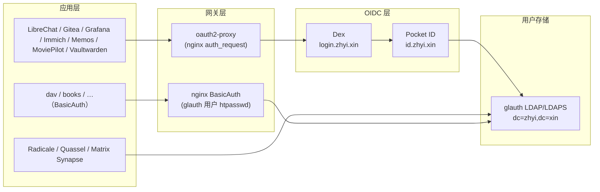

# 身份认证架构

> 最后核对：2026-08-15（对照作者原版 `nixos-config-exam`）。
> 本文描述身份链的静态架构；新增 OIDC 应用的**操作步骤**见
> [OIDC 应用接入规范](./oidc-app-integration.md)，运行态账本见
> [全主机服务归属与链路](./fleet-service-chain.md)。

## 一句话总结

**单一用户存储（glauth LDAP）+ 多前端认证（Pocket ID Passkey / LDAP 密码 /
nginx BasicAuth）+ Dex OIDC 出口 + oauth2-proxy 应用网关**。所有登录最终都落到
同一个 glauth 用户库；没有第二套目录服务。

```
应用 Nginx ──> oauth2-proxy ──> Dex (login.zhyi.xin)
                                  └─> connector: Pocket ID (id.zhyi.xin)
                                                   └─> 用户后端: glauth LDAP
Radicale / Quassel / Matrix Synapse ──> glauth LDAP（直连）
简单服务（dav/books/…）──> nginx BasicAuth（htpasswd 来自同一 glauth 用户）
```

## 架构图



## 组件明细

| 组件 | 角色 | 入口/协议 | 承载主机 | 数据源 |
| --- | --- | --- | --- | --- |
| **glauth** | 用户目录（LDAP/LDAPS） | `:389` / `:636`，baseDN `dc=zhyi,dc=xin` | `volcengine`、`rock5c`（独立实例） | secrets `glauth-users.nix`（bcrypt） |
| **Pocket ID** | Passkey（无密码）身份提供方 | `https://id.zhyi.xin` | `volcengine` | PostgreSQL；用户后端 = glauth LDAP（`LDAP_ENABLED=true`） |
| **Dex** | OIDC 出口/聚合（应用统一入口） | `https://login.zhyi.xin` | `volcengine` | PostgreSQL；connector = Pocket ID |
| **oauth2-proxy** | Nginx 层 OAuth 强制 | 本机 unix socket | `volcengine`/`rock5c`/`opi5p`（随 vhost） | secrets `oauth2-proxy` cookie |
| **Vaultwarden** | 密码库（旁路） | `https://bitwarden.zhyi.xin` | `volcengine` | 自有数据库 |
| **nginx BasicAuth** | 简单服务共享凭据（旁路） | vhost `enableBasicAuth` | 各承载主机 | htpasswd 由 `glauth-users.nix` 的 `zhyi` 生成 |

## 认证流程

### 1. 交互式应用（OIDC，推荐）

```
浏览器 → 应用（如 https://ai.zhyi.xin）
  → oauth2-proxy 检测未登录 → 302 到 Dex（login.zhyi.xin）
  → Dex connector 转发到 Pocket ID（id.zhyi.xin）
  → Pocket ID Passkey 验证（或回退 LDAP 密码）
  → 回调 Dex → 签发 OIDC token → oauth2-proxy 通过 auth_request
  → 应用拿到 X-User / X-Email / X-Groups 头
```

### 2. 协议型应用（直连 LDAP）

Radicale（`cal.zhyi.xin`）、Quassel、Matrix Synapse 直接向 glauth 做
LDAP bind（`cn=serviceuser,dc=zhyi,dc=xin`），凭据即用户目录里的密码。

### 3. 简单服务（BasicAuth）

`enableBasicAuth` 的 vhost（dav、books 等）用 glauth 用户 `zhyi` 的 htpasswd
校验；凭据与 LDAP 密码一致，不新增账号体系。

## OIDC 客户端（Dex staticClients）

| client id | 应用 | 说明 |
| --- | --- | --- |
| `gitea` | Gitea | git.zhyi.xin |
| `grafana` | Grafana | dashboard.zhyi.xin |
| `immich` | Immich | immich.zhyi.xin |
| `librechat` | LibreChat | ai.zhyi.xin |
| `memos` | Memos | memos.opi5p.zhyi.cc |
| `moviepilot` | MoviePilot | moviepilot.rock5c.zhyi.cc |
| `oauth-proxy` | oauth2-proxy | 所有 `enableOAuth` vhost 共用 |
| `vaultwarden` | Vaultwarden | bitwarden.zhyi.xin |

## 凭据与 secrets

| 资产 | 位置 | 说明 |
| --- | --- | --- |
| 用户目录（明文） | secrets `glauth-users.nix` | `zhyi`（uid 1000）、`serviceuser`（bind）、各服务账号；只含 bcrypt/mail 等非敏感字段 |
| glauth 服务凭据（加密） | secrets `common/glauth.yaml` | glauth 进程使用的敏感字段 |
| Dex 客户端密钥 | secrets `common/dex.yaml` | 每个 staticClient 一个 `dex-<id>-secret` |
| Pocket ID | secrets `pocket-id.yaml` | 加密密钥 + Dex 对接凭据 |
| oauth2-proxy | secrets `common/oauth2-proxy.yaml` | cookie 密钥等 |
| Vaultwarden | `dex-vaultwarden-secret`（common/dex.yaml）+ 自有数据库 | SSO 走 Dex，数据自管 |

## 与作者原版的对应（复刻对照）

| 项 | 作者（xddxdd） | 本仓库 | 差异说明 |
| --- | --- | --- | --- |
| LDAP baseDN | `dc=lantian,dc=pub` | `dc=zhyi,dc=xin` | 域名替换 |
| 主用户 | `lantian` | `zhyi` | 域名替换 |
| Dex connector | Pocket ID（`id="ldap"` 向后兼容） | 同左 | 原样保留 |
| 部署分布 | colocrossing 全套 + lt-home-vm/virmach 各一份 glauth | volcengine 全套 + rock5c 一份 glauth | 布局一致（主节点 + 家庭/边缘节点） |
| 入口 | login.lantian.pub / id.lantian.pub / bitwarden | login.zhyi.xin / id.zhyi.xin / bitwarden.zhyi.xin | 域名替换 |

> 作者的 Dex connector `id = "ldap"`（注释 "Backwards compatibility"）是历史演化
> 痕迹：Dex 从"直连 LDAP"迁移到"经 Pocket ID"，但 connector id 保持不变，避免
> 已接入应用刷新缓存后失配。我们复刻时原样保留。

## 运维要点

1. 新增 OIDC 应用：按 [OIDC 应用接入规范](./oidc-app-integration.md) 四步走
   （dex staticClients + secrets + flake bump + 部署 volcengine）。
2. `volcengine` 与 `rock5c` 的 glauth 是**两个独立实例**，用户数据不同步；迁移或
   排障时不能当作同一个进程。
3. 改用户密码/增删用户：编辑 secrets `glauth-users.nix`，bump secrets 输入后
   部署对应 glauth 主机；BasicAuth 的 htpasswd 会在构建时自动重新生成。
4. 认证优先级：Passkey（Pocket ID）> LDAP 密码 > BasicAuth；三者共用同一
   用户存储，不存在"另一套账号"。
5. 不要把任一网关（oauth2-proxy 之外的自建代理）反向接到身份链上绕过认证；
   新增公开服务必须满足 `minimal-policies` 的"公网 vhost 必须认证"断言。
