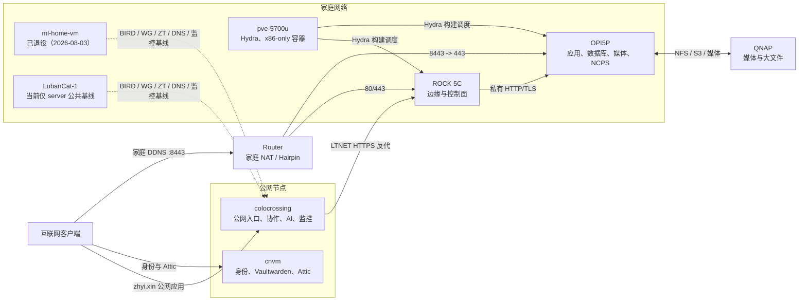
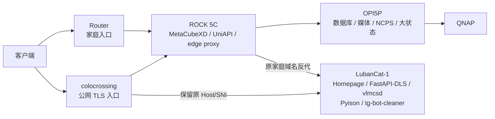

# 服务链路与 LubanCat-1 迁移审计

最后审计：2026-08-03

本文以当前仓库声明和实机资源快照为准，说明各主机实际承担的服务链路，并评估哪些
服务适合迁入 2 GiB RAM、SD 卡持久化的 LubanCat-1。本文只给出迁移决策和执行边界，
不表示这些服务已经迁移。

完整的 14 台主机服务归属、实机运行状态和跨主机调用关系见
[`全主机服务归属与链路`](fleet-service-chain.md)。本文只保留与 LubanCat-1 容量和
迁移批次直接相关的结论。

## 结论

LubanCat-1 可以承担一组低写入、ARM64 原生、可由现有入口反向代理的轻服务。建议
第一批只迁移：

1. Homepage Dashboard：从 ROCK 5C 迁入，预计释放约 224 MiB；
2. FastAPI-DLS：从 ROCK 5C 迁入，预计释放约 122 MiB，迁移前必须备份 SQLite 和
   RSA key；
3. vlmcsd：从 ROCK 5C 迁入，资源占用很小，但服务地址可由 BIRD 保持透明；
4. Pyison：从 colocrossing 迁入，先确认容器镜像具有 ARM64 manifest，公网 TLS
   入口仍留在 colocrossing；
5. tg-bot-cleaner：从 colocrossing 迁入，复制 Telethon session 等状态后再切换。

这一批预计让 LubanCat-1 从约 478 MiB 基线增长到约 0.9 GiB，仍保留约 1 GiB
物理内存和 zram 作为峰值余量。ROCK 5C 可释放约 346 MiB，colocrossing 只能释放
少量内存。该方案不会显著降低 OPI5P 的 9 GiB 以上使用量；OPI5P 的主要负载不适合
迁到只有 SD 卡和 2 GiB RAM 的板卡。

## 当前服务链路



### 主机职责

| 主机 | 当前主要职责 | 不应混入的职责 |
| --- | --- | --- |
| cnvm | Attic、Dex、Pocket ID、Vaultwarden、Halo、GLAuth | 家庭数据面、重型构建 |
| colocrossing | 公网 Nginx、Gitea、Matrix、邮件、AI、监控、协作服务 | 家庭媒体存储 |
| ROCK 5C | 家庭入口、MetaCubeXD、UniAPI、Homepage、FastAPI-DLS、reDroid | 数据库、NAR、媒体数据 |
| OPI5P | 数据库、Immich、Linkwarden、媒体链、NCPS、文件服务、reDroid | 高并发分布式构建 |
| pve-5700u | Hydra、x86_64-only 容器和虚拟机 | ARM 交叉内核大包 |
| ml-home-vm | 已退役（2026-08-03），不再承载用户应用 | 不应再被文档当作在线主机 |
| LubanCat-1 | 当前只有 `server` 公共基线 | 数据库、缓存、浏览器任务、构建任务 |

### 关键业务链

| 链路 | 当前路径 | 迁移时必须保持的条件 |
| --- | --- | --- |
| 身份 | 客户端 -> cnvm -> Dex/Pocket ID/GLAuth | 域名、回调 URL 和数据库位置不变 |
| AI | 客户端 -> colocrossing/ROCK 5C -> UniAPI -> Provider | UniAPI 继续作为唯一 Provider 汇聚点 |
| 家庭应用 | 客户端 -> colocrossing 或 Router -> ROCK 5C -> OPI5P | 公网 TLS 和原 Host/SNI 不变 |
| 媒体与存储 | 客户端 -> OPI5P -> QNAP | 不让 ROCK 5C 或 LubanCat-1 中转大流量 |
| 构建与缓存 | Hydra/构建机 -> NCPS/Attic -> 上游缓存 | 不把 NAR 缓存和构建写入 SD 卡 |
| 监控 | 各主机 exporter -> colocrossing Prometheus/Grafana | 被迁服务的 scrape target 同步修改 |

## 资源快照

以下是 2026-08-03 空闲期实测，用于判断迁移方向。cgroup 可能统计共享页，容量判断
以 `free` 为主。

| 主机 | RAM | 已用/可用 | 持久盘特点 | 判断 |
| --- | ---: | ---: | --- | --- |
| LubanCat-1 | 1.9 GiB | 478 MiB / 1.5 GiB | 约 30 GiB SD 卡 | 可接收低写入轻服务 |
| ROCK 5C | 7.7 GiB | 2.2 GiB / 5.6 GiB | 256 GB eMMC | 有余量，但可下放部分控制面 |
| OPI5P | 15 GiB | 9.6 GiB / 6.0 GiB | 2 TB NVMe + QNAP | 压力来自重型应用，不适合向 Luban 平移 |
| ml-home-vm | 19 GiB（历史快照） | 2.7 GiB / 16 GiB | 虚拟磁盘 + QNAP | 已退役（2026-08-03）；仅作迁移前容量记录 |
| pve-5700u | 46 GiB | 16 GiB / 30 GiB | `/nix` 使用率约 76% | 保留 Hydra、VM 和 x86-only 服务 |
| cnvm | 1.9 GiB | 1.5 GiB / 435 MiB | 云盘 | 内存紧张，但状态服务不宜迁到家庭 SD 板 |
| colocrossing | 7.7 GiB | 4.3 GiB / 3.4 GiB | 云盘 | swap 已接近满，适合移出少量非关键服务 |

LubanCat-1 的常驻基线主要是 Nginx、Yggdrasil、CoreDNS、ZeroTier、BIRD、exporter
和日志组件。迁移后应把稳定状态控制在约 1.1–1.2 GiB 以下，并至少保留
500–700 MiB `MemAvailable`；zram 是故障缓冲，不是日常容量。

## 迁移决策矩阵

### 第一批：建议迁移

| 服务 | 来源 | 实测量级 | 状态/依赖 | 决策 |
| --- | --- | ---: | --- | --- |
| Homepage Dashboard | ROCK 5C | 约 224 MiB cgroup | 声明式配置与 secrets，低写入 | 建议；迁入后保留原域名和入口反代 |
| FastAPI-DLS | ROCK 5C | 约 122 MiB | SQLite、RSA keys、既有租约 URL | 建议；停写、校验数据后单实例切换 |
| vlmcsd | ROCK 5C | 很小 | netns、BIRD 服务地址 | 建议；位置可由路由透明化 |
| Pyison | colocrossing | 约 13 MiB | 容器，近似无状态 | 建议；先验证 ARM64 镜像，公网入口不动 |
| tg-bot-cleaner | colocrossing | 预计数十 MiB | Telegram secrets、session 状态 | 建议；复制 session，禁止双实例运行 |

预计目标拓扑：



### 第二批：技术可行，但收益有限

| 服务 | 来源 | 限制 | 决策 |
| --- | --- | --- | --- |
| Radicale | colocrossing | 用户日历、LDAP、文件状态 | 备份 collections 后可迁，非第一批 |
| SunPanel | OPI5P | 两个容器和本地配置，实际约 21 MiB | 可迁但几乎不能缓解 OPI5P |
| ASF | OPI5P | host network、约 37 MiB、持久配置 | 可迁但收益有限 |
| Memos | OPI5P | SQLite，实际约 8 MiB | 风险大于节省，不优先 |
| FileCodeBox | OPI5P | 上传数据和状态目录 | 仅在数据落 QNAP 时考虑 |

### 不值得迁移

- worker-vless2sub 和 OpenSpeedTest 主要是 Nginx 静态内容，几乎不释放常驻内存；
- imapfilter 主要通过 timer/oneshot 运行，迁移不能减少明显的空闲内存；
- Calibre COPS 依赖 QNAP 书库，迁移只会让 LubanCat-1 新增 NAS 可用性依赖。

这些服务可以在以后为“配置归属一致性”随同入口迁移，但不能作为降低内存占用的
理由。

### 禁止迁入 LubanCat-1

- Attic、NCPS、PostgreSQL、MySQL、Redis、ClickHouse 等高写入数据或缓存服务；
- Immich、Jellyfin、HandBrake、Tachidesk、Linkwarden、ArchiveBox 和媒体自动化；
- reDroid、Byparr、RSSHub、SearXNG 等具有浏览器、Android 或突发内存负载的服务；
- Dex、Pocket ID、Vaultwarden、GLAuth 等身份和密钥链核心服务；
- MetaCubeXD：它同时承担家庭代理和构建下载出口，迁移会制造循环依赖；
- UniAPI：它是 AI 链路唯一 Provider 汇聚点，第一批不能与普通轻服务一起切换；
- Prometheus、Grafana、Matrix、Gitea 和邮件等公网核心服务；
- Hydra、Nix builder、NAR cache，以及只发布 x86_64 镜像的容器。

## 真正的内存优化方向

LubanCat-1 迁移不是 OPI5P 内存问题的主要解法。OPI5P 当前较大的消费者包括
ClamAV 约 1 GiB、reDroid 约 852 MiB、Tachidesk 约 856 MiB、Immich、数据库、
Jellyfin 与媒体自动化。建议另行审计：

1. 如果两个 RK3588 上只需要一个 Android 实例，停用一套重复 reDroid，可直接
   节省约 850 MiB；
2. 调整 ClamAV 扫描时段或常驻策略，而不是迁到 LubanCat-1；
3. colocrossing 的监控数据库若需整体减压，应优先迁到当前在线的可靠 NVMe/VM
   主机，不要迁到 2 GiB 板卡；`ml-home-vm` 已退役，不能再作为候选；
4. cnvm 的压力应通过实例扩容，或把 Halo 这类完整状态链迁到可靠 NVMe 主机；不要
   为释放几十 MiB 把公网状态服务放到家庭 SD 卡。

## 执行规范与回滚

每次只迁一个服务，且只在 `hosts/lubancat1/configuration.nix` 增加现有模块 import
和必要的主机局部 override。不要复制服务模块，也不要为 LubanCat-1 改写作者的公共
`server` 模块。

迁移步骤统一为：

1. 记录源服务内存、端口、vhost、secret、状态目录和最近备份；
2. 在 LubanCat-1 部署服务定义，但用 activation marker 阻止其提前成为 writer；
3. 对有状态服务停止源实例，复制数据并核对文件数量、权限和 checksum；
4. 先通过 LTNET 或 LAN 直接验收，再修改源入口的反代后端；
5. 保留原域名、TLS 入口、OAuth 回调、Prometheus target 和 Homepage 链接；
6. 观察至少一个定时任务周期和一次冷启动，确认 `systemctl --failed` 为 0；
7. 旧状态保持只读且不删除，回滚时停止 Luban 实例并把反代指回原主机。

最低验收项：

```bash
systemctl --failed
free -h
systemd-cgtop --depth=2
zramctl
df -h /nix
birdc show protocols
```

当 `MemAvailable` 长期低于 500 MiB、zram 持续增长、SD 卡写入异常或冷启动出现
服务超时时，停止继续迁入，并回滚最近一个服务。

## 与作者原版的偏差边界

作者原版仍把 Pyison、imapfilter、Radicale、RSSHub、tg-bot-cleaner 和
Yggdrasil ALFIS 放在 colocrossing，把 FastAPI-DLS、UniAPI、vlmcsd 放在家庭 VM。
本方案把其中少量轻服务放到 LubanCat-1，是为了利用新增硬件的主机级调整，不应演变
成公共模块分叉。

允许的偏差只有：LubanCat-1 的 imports、服务 activation marker、资源限制和入口
主机的反代目标。服务模块、端口常量、域名职责、AI 链路和身份链继续沿用作者结构。

## 审计时发现并已修正的文档漂移

- `docs/services/homepage-link-audit.md` 曾把 Homepage 写成运行在 ml-home-vm；当前
  已改为 ROCK 5C 实际运行、旧域名仅作兼容服务名；
- `docs/infrastructure/ai-api-gateway-chain.md` 曾把主 UniAPI 写在 ml-home-vm；当前
  已改为 ROCK 5C 实际运行，并把未部署的 AxonHub 从活动链路中移出；
- `ml-home-vm` 已于 2026-08-03 退役，主机定义从 flake 移除，不再承载用户应用。

后续迁移必须以当前 Nix 配置和实机状态为准，并同步修正文档；不能因为旧域名中仍含
`ml-home-vm` 就推断服务仍运行在该 VM。
